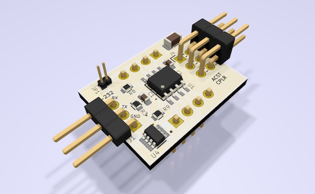

# soylent

`soylent` is an "aspirational" (i.e. entirely untested, and designed by an electronics neophyte) hardware design for a tiny hardware modem for the TI Silent 707 briefcase teletype from the [Texas Instruments Silent 700 series](https://en.wikipedia.org/wiki/Silent_700).

The teletype speaks 300-baud [FSK](https://en.wikipedia.org/wiki/Frequency-shift_keying) using the [Bell 103 dataset](https://en.wikipedia.org/wiki/Bell_103_modem). The modem is designed to connect directly to the acoustic-coupler interface of the teletype, which supplies power to the modem as well as providing the FSK audio signal. The modem is designed to implement full-duplex translation between the FSK signal and a minimal [RS-232](https://en.wikipedia.org/wiki/RS-232) serial connection at 300bps.

The intention is for the [tynsel](https://github.com/kulp/tynsel) project to supply a software implementation for the [AVR microcontroller](https://www.microchip.com/wwwproducts/en/ATTINY412) in the `soylent` design. For now, `soylent` serves mainly as a playground for the author to learn [KiCad](https://kicad-pcb.org).
